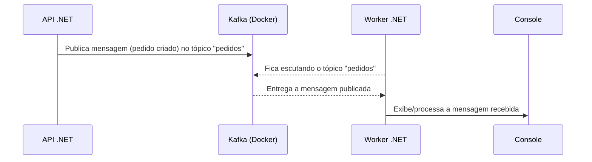

# Loja Virtual - Exemplo com .NET, Kafka, PostgreSQL e Docker

Este projeto é um exemplo didático de uma loja virtual, criado para aprender e demonstrar integração entre:

- **ASP.NET Core (C#)** - Backend (API REST)
- **PostgreSQL** - Banco de dados relacional
- **Apache Kafka** - Mensageria para eventos
- **Docker Compose** - Orquestração dos serviços
- (Em breve) **Angular** - Frontend

## Fluxo de Eventos com Kafka

### 1. **KafkaProducerService (Produtor de eventos Kafka na API)**
- Classe responsável por publicar mensagens no Kafka.
- Usa o endereço do broker (ex: `localhost:9092`) configurado no `appsettings.json`.
- Método `PublishAsync` serializa o objeto e publica no tópico `pedidos`.

### 2. **API .NET (Backend)**
- Expõe endpoints REST para criar produtos e pedidos.
- Ao criar um pedido, salva no banco e publica um evento no Kafka usando o `KafkaProducerService`.

### 3. **Worker .NET (Consumidor Kafka)**
- Serviço separado que se conecta ao Kafka e escuta o tópico `pedidos`.
- Exibe/processa as mensagens recebidas no console.

### Diagrama do fluxo



## Funcionalidades
- Cadastro de produtos (CRUD)
- Cadastro de pedidos (CRUD)
- Relacionamento N:N entre pedidos e produtos
- Integração com PostgreSQL via Entity Framework Core
- Documentação e testes via Swagger
- Pronto para integração com Kafka (publicação/consumo de eventos)

## Como rodar o projeto

### 1. Suba os serviços com Docker Compose
```sh
docker-compose up -d
```

### 2. Rode a API
```sh
dotnet run --project src/api/api.csproj
```
Acesse o Swagger em: [http://localhost:5022/swagger](http://localhost:5022/swagger)

### 3. Rode o Worker para consumir mensagens do Kafka
```sh
dotnet run --project src/worker/worker.csproj
```

### 4. Teste os endpoints
- Cadastre produtos
- Cadastre pedidos (veja a mensagem aparecer no Worker)

## Estrutura do Projeto
```
net-kafka/
  ├─ docker-compose.yml
  └─ src/
      ├─ api/        # Projeto ASP.NET Core (API)
      └─ worker/     # Worker para consumir Kafka
```

## Tecnologias
- .NET 9
- PostgreSQL 15
- Apache Kafka 7.5 (Confluent)
- Docker Compose
- Swagger (Swashbuckle)

## Próximos Passos
- [ ] Frontend Angular elegante e funcional

---

Feito para estudo e aprendizado 🚀
