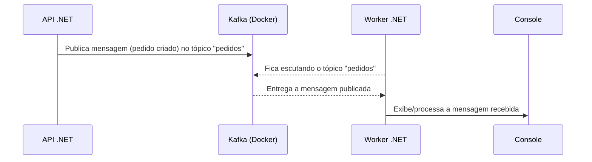

# Loja Virtual - Exemplo com .NET, Kafka, PostgreSQL, Angular e Docker

Este projeto é um exemplo didático de uma loja virtual, criado para aprender e demonstrar integração entre:

- **ASP.NET Core (C#)** - Backend (API REST)
- **PostgreSQL** - Banco de dados relacional
- **Apache Kafka** - Mensageria para eventos
- **Docker Compose** - Orquestração dos serviços
- **Angular** - Frontend moderno e responsivo

## Frontend Angular

O frontend foi desenvolvido em Angular, inspirado em lojas femininas modernas como [DaLuz Moda Feminina](https://www.daluzloja.com.br/). O visual utiliza:

- **Angular Material** para componentes prontos e responsivos
- **Grid de produtos em cards** com imagem, preço destacado e botão de compra
- **Barra superior fixa** com logo, menu e botão de carrinho
- **Paleta de cores feminina** (rosa, lilás, branco) e fundo suave
- **Fontes elegantes**: Poppins (principal), Playfair Display (títulos) e Dancing Script (detalhes)
- **Layout responsivo** e moderno

### Como rodar o frontend

1. Instale as dependências:
   ```sh
   cd src/frontend
   npm install
   ```
2. Rode o frontend com proxy para a API:
   ```sh
   npm start
   ```
   O app estará disponível em [http://localhost:4200](http://localhost:4200)

### Estrutura visual
- Barra superior com logo e menu
- Produtos exibidos em cards com imagem, preço e botão de compra
- Visual inspirado em lojas de moda feminina, mas facilmente adaptável para outros segmentos

---

## Fluxo de Eventos com Kafka

### 1. **KafkaProducerService (Produtor de eventos Kafka na API)**
- Classe responsável por publicar mensagens no Kafka.
- Usa o endereço do broker (ex: `localhost:9092`) configurado no `appsettings.json`.
- Método `PublishAsync` serializa o objeto e publica no tópico `pedidos`.

### 2. **API .NET (Backend)**
- Expõe endpoints REST para criar produtos e pedidos.
- Ao criar um pedido, salva no banco e publica um evento no Kafka usando o `KafkaProducerService`.

### 3. **Worker .NET (Consumidor Kafka)**
- Serviço separado que se conecta ao Kafka e escuta o tópico `pedidos`.
- Exibe/processa as mensagens recebidas no console.

### Diagrama do fluxo



## Como rodar o projeto completo

### 1. Suba os serviços com Docker Compose
```sh
docker-compose up -d
```

### 2. Rode a API
```sh
dotnet run --project src/api/api.csproj
```
Acesse o Swagger em: [http://localhost:5022/swagger](http://localhost:5022/swagger)

### 3. Rode o Worker para consumir mensagens do Kafka
```sh
dotnet run --project src/worker/worker.csproj
```

### 4. Rode o Frontend Angular
```sh
cd src/frontend
npm install
npm start
```
Acesse em: [http://localhost:4200](http://localhost:4200)

### 5. Teste os endpoints
- Cadastre produtos
- Cadastre pedidos (veja a mensagem aparecer no Worker)
- Veja os produtos no frontend

## Estrutura do Projeto
```
net-kafka/
  ├─ docker-compose.yml
  └─ src/
      ├─ api/        # Projeto ASP.NET Core (API)
      ├─ worker/     # Worker para consumir Kafka
      └─ frontend/   # Frontend Angular
```

## Tecnologias
- .NET 9
- PostgreSQL 15
- Apache Kafka 7.5 (Confluent)
- Docker Compose
- Angular 17+
- Angular Material
- Swagger (Swashbuckle)

## Próximos Passos
- [ ] Formulário de pedidos no frontend
- [ ] Listagem de pedidos no frontend
- [ ] Banners e carrossel de lançamentos

---

Feito para estudo e aprendizado 🚀
